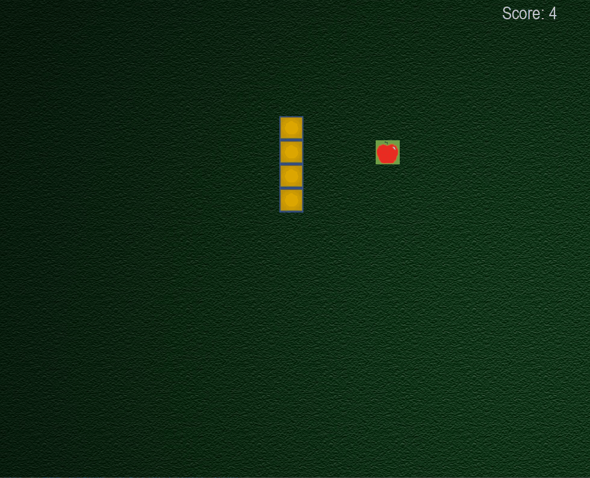

## Overview
In this project I have built a complete snake and apple video game using pygame module.  
Snake and apple is a simple game where when snake eats an apple it gets longer and your score increases.If you snake hits any part of its body it will die.  

This repository contains a Python project with a primary script `main.py`.  
To run the `main.py` script successfully, it is necessary to also download the associated resource files included in this repository.
# Resource Files  

apple.jpg  
background.jpg  
bg_music_1.mp3  
block.jpg  
crash.mp3  
ding.mp3  

Ensure these  files are present in the resources directory.

